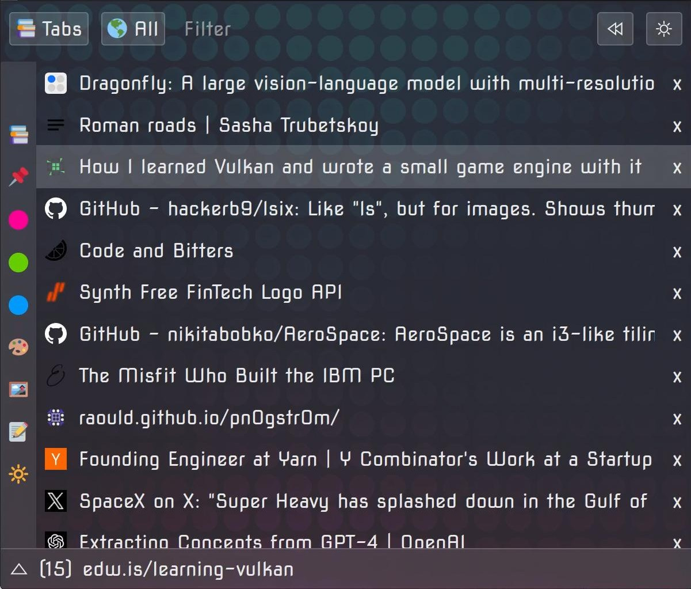

# Grasshopper

[Download](https://addons.mozilla.org/firefox/addon/grasshopper-urls/)
| [Credits](md/credits.md) | [Lore](md/lore.md) | [Reviews](md/reviews.md) | [Development](md/development.md)

You can contribute by reporting bugs or by explaining how some things can be improved or fixed with concepts, pseudo code, or code examples, but I won't accept pull requests.

Email: grasshopper@merkoba.com

---

Copyright (c) 2022 Merkoba

This software is dual-licensed:

1. Under the GNU General Public License v3.0 (GPLv3) or later.
   You may use, modify, and distribute this software under the terms of the
   GPLv3. A copy of this license is included in the file LICENSE.GPL or
   available at <https://www.gnu.org/licenses/gpl-3.0.html>.

   ANY DERIVATIVE WORKS DISTRIBUTED MUST BE UNDER THE GPLv3 AND THE COMPLETE
   CORRESPONDING SOURCE CODE MUST BE MADE AVAILABLE.

2. Under a commercial license.
   If you wish to use this software in a closed-source, proprietary, or
   commercial product without the obligations of the GPLv3, contact
   grasshopper@merkoba.com to obtain a commercial license.

Unless you have entered into a separate commercial license agreement, your
use of this software is governed by the GPLv3.