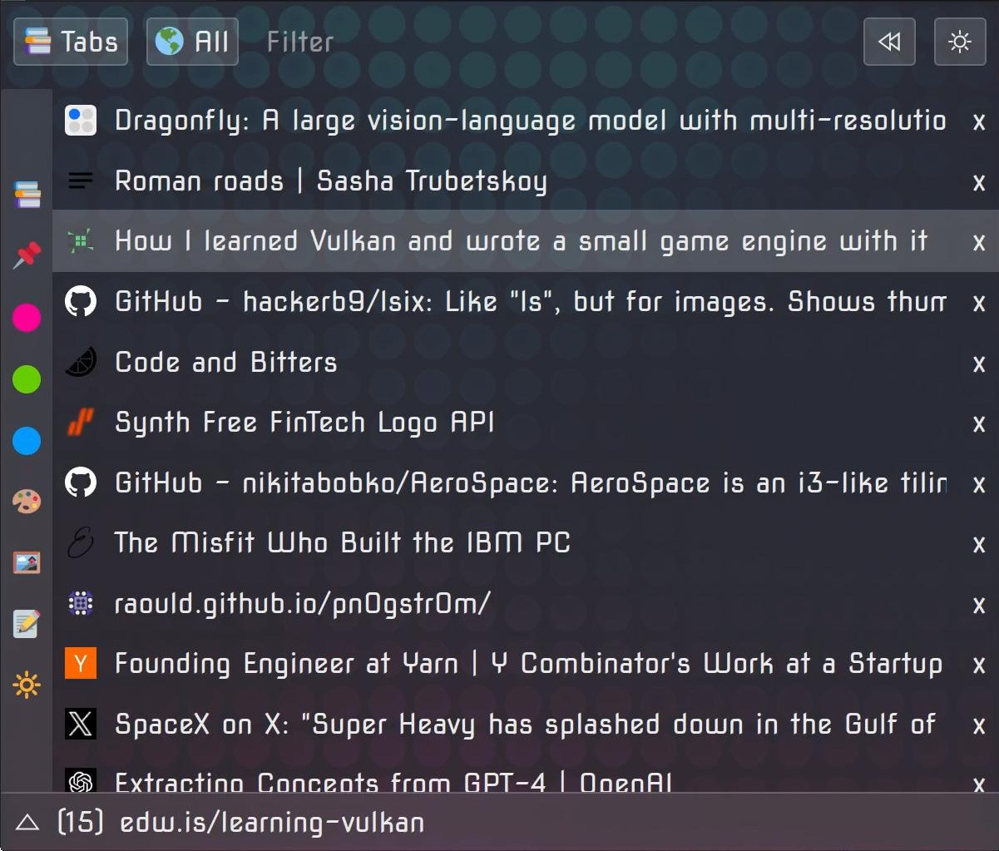

# Grasshopper

[Download](https://addons.mozilla.org/firefox/addon/grasshopper-urls/)
| [Credits](md/credits.md) | [Lore](md/lore.md) | [Reviews](md/reviews.md) | [Development](md/development.md)

## What is this?

It's a tab manager extension for `Firefox` that is used as a sidebar or as a popup. It has almost `1000` settings, allowing extreme configurability and advanced (and niche) features. It has hundreds of commands, which can be launched with a command palette, clicks, or shortcuts.

The complexity and capabilities are such that I compare it to an `operating system` or a `desktop environment`, when you use Firefox as the engine. The settings manager allow many different kinds of setups, not only aesthetically but functionally, so different vendors could easily create `distros` using specific configurations.

---

## Some Features

- Tab management. What you'd expect: Focus, move, close, duplicate, tag, color, add icon, set a custom title, pin/unpin, unload, mute.

- Filter. Find tabs by typing. Filter by tab type, with over 30 modes.

- Tab Box. An extra view at the bottom to always have certain tabs in view.

- Filterable Menus. All context menus can be filtered by typing anything, to find items very quickly.

- Go To Playing Tab. Go to the tabs emitting sound by clicking a button or selecting items from a list.

- Close Tabs. Over 18 ways of closing tabs using different criteria.

- Signals. A signal system to interface with programs, using `GET`, `POST`, `PUT`.

- Title Bar. Set a custom title, or use the date, or display information dynamically. For instance you could show `Now Playing` information if you use `Signals` and check the music you are listening to.

- Zones. Create special tabs that act as visual dividers. These are normal tabs, but special within Grasshopper.

- Favorites. A favorites bar that can be placed at any side, with a selection of commands.

- Obfuscate Tabs. Scramble the text and favicon of a tab so others can't see it. Restore it anytime.

- Notes. Simple global notepad to take notes. And per-tab notes to annotate information on specific tabs.

- Cael. AI assistant that can help you with settings and commands, or just talk. This uses Gemini.

- Datastore. Data store system to store different versions of settings, notes, or themes.

- Stuff. An assorted collection of small interesting & useful tools, including some easter eggs.

- Lock Screen. Lock the sidebar, and optional require a password to unlock. Soft security.

- History. Change the mode to recent browsing history.

- Bookmarks. Change the view to bookmarks. Bookmark tabs.

- Closed. Change the view to to view recently closed tabs. Restore tabs.

- Global. View tabs from all windows.

- Auto Click. Click things by just hovering over them with the mouse for a while.

- Media. View images and videos from tabs.

- Warnings. Get warnings on certain actions. Like warn when closing a tab that is emitting sound. All configurable.

- Footer. Information at the bottom. Tab Box toggle. Other controls.

- Theme. Change background color, text color, background image, font, border colors. Use a custom CSS.

- Colors. Color tabs, and configure how they are seen, like icons, background. Define custom colors.

- Pinline. A separator between pins and normal tabs which shows information.

- Gestures. Middle click and drag to do gestures. Configurable.

- Icons. Define custom icons, add them to tabs. Customize all the icons, including when they are visible, and their positions.

- Tags. Add one or more tags to tabs. Show  them in different ways.

- Shortcuts. Configure and add keyboard shortcuts, map them to any command.

- Combos. Create command combos, which are a sequence of commands. These appears as another command which you can map anywhere.

- Auto Close. Make unused tabs to close automatically after some time. This avoids collecting hundreds of tabs.

- Mouse Events. Most UI elements allow to be mapped with commands on click, middle click, middle click press, click press, shift click, ctrl click, ctrl shift click, wheel up, wheel up. Depends on the element.

- Tree. Track which are the parents of the other tabs, which can be used for tab management or visual categorization. This is not tree tab style. This just adds icons on the tabs, and allows some operations.

- Auto Blur. Blur the sidebar when the mouse leaves, unblur it when it enters.

And more.

---

You can contribute by reporting bugs or by explaining how some things can be improved or fixed with concepts, pseudo code, or code examples, but I won't accept pull requests.

Email: grasshopper@merkoba.com

---

Copyright (c) 2022 Merkoba

This software is dual-licensed:

1. Under the GNU General Public License v3.0 (GPLv3) or later.
   You may use, modify, and distribute this software under the terms of the
   GPLv3. A copy of this license is included in the file LICENSE.GPL or
   available at <https://www.gnu.org/licenses/gpl-3.0.html>.

   ANY DERIVATIVE WORKS DISTRIBUTED MUST BE UNDER THE GPLv3 AND THE COMPLETE
   CORRESPONDING SOURCE CODE MUST BE MADE AVAILABLE.

2. Under a commercial license.
   If you wish to use this software in a closed-source, proprietary, or
   commercial product without the obligations of the GPLv3, contact
   grasshopper@merkoba.com to obtain a commercial license.

Unless you have entered into a separate commercial license agreement, your
use of this software is governed by the GPLv3.